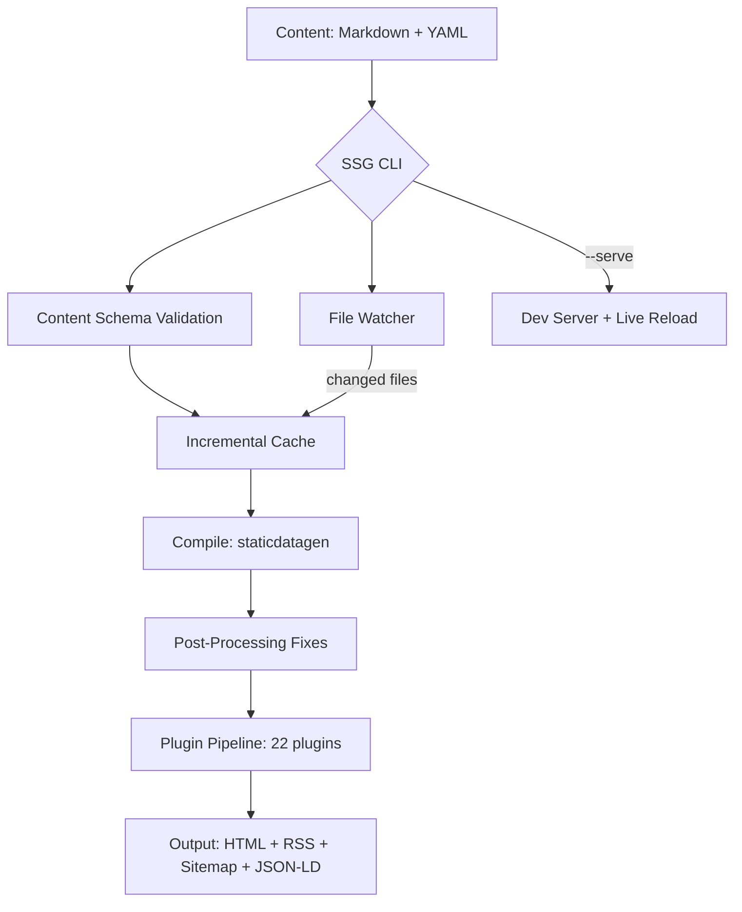

<!-- SPDX-License-Identifier: Apache-2.0 OR MIT -->

<p align="center">
  
</p>

<h1 align="center">Static Site Generator (SSG)</h1>

<p align="center">
  <strong>Fast, memory-safe, and extensible — built in Rust.</strong>
</p>

<p align="center">
  <a href="https://github.com/sebastienrousseau/static-site-generator/actions"></a>
  <a href="https://crates.io/crates/ssg"></a>
  <a href="https://docs.rs/ssg"></a>
  <a href="https://codecov.io/gh/sebastienrousseau/static-site-generator"></a>
  <a href="https://lib.rs/crates/ssg"></a>
</p>

---

## Contents

- [Install](#install) — one-liner, Homebrew, Cargo, apt, AUR, Scoop, winget
- [Quick Start](#quick-start) — scaffold a site in 30 seconds
- [Overview](#overview) — what SSG does
- [Architecture](#architecture) — build pipeline diagram
- [Features](#features) — v0.0.36 capability matrix
- [The CLI](#the-cli) — flags and usage
- [Library Usage](#library-usage) — `ssg::run()`, plugins, schemas
- [Benchmarks](#benchmarks) — binary size, test suite, coverage
- [Development](#development) — make targets, contributing
- [What's Included](#whats-included) — all 36 modules
- [License](#license)

---

## Install

### Quick install (prebuilt binary)

**macOS / Linux — one command:**

```sh
curl -fsSL https://raw.githubusercontent.com/sebastienrousseau/static-site-generator/main/scripts/install.sh | sh
```

Auto-detects your OS and architecture, downloads the correct binary from GitHub Releases, verifies the SHA256 checksum, and installs to `~/.local/bin`.

**Homebrew (macOS / Linux):**

```sh
brew install --formula https://raw.githubusercontent.com/sebastienrousseau/static-site-generator/main/Formula/ssg.rb
```

**Cargo (any platform with Rust):**

```sh
cargo install ssg
```

**Debian / Ubuntu (apt):**

```sh
# Download the .deb from the latest release, then:
sudo dpkg -i ssg_0.0.36_amd64.deb
```

Or build it yourself with `pkg/deb/build.sh`.

**Arch Linux (AUR):**

```sh
# Using an AUR helper (e.g. yay):
yay -S ssg
```

Or build manually with the PKGBUILD in `pkg/arch/`.

**Windows (Scoop):**

```powershell
scoop bucket add ssg https://github.com/sebastienrousseau/shokunin
scoop install ssg
```

**Windows (winget):**

```powershell
winget install sebastienrousseau.ssg
```

**Windows (manual):** download the `.zip` from the [latest release](https://github.com/sebastienrousseau/static-site-generator/releases/latest), extract `ssg.exe`, and add it to your `PATH`.

### Use as a library

```toml
[dependencies]
ssg = "0.0.36"
```

### Build from source

```bash
git clone https://github.com/sebastienrousseau/static-site-generator.git
cd static-site-generator
make init    # installs toolchain, hooks, builds
cargo test --lib
```

Requires **Rust 1.88.0+** (pinned in `rust-toolchain.toml`).

---

## Quick Start

```bash
# 1 — Install
cargo install ssg

# 2 — Scaffold a new site
ssg -n mysite -c content -o build -t templates

# 3 — Build with custom content
ssg -c content -o public -t templates

# 4 — Validate content schemas (no build)
ssg --validate -c content

# 5 — Development server
ssg -c content -o public -t templates -s public
```

---

## Overview

SSG generates static websites from Markdown content, YAML frontmatter, and HTML templates. It compiles everything into production-ready HTML with built-in SEO metadata, accessibility compliance, and feed generation. The plugin system handles the rest.

- **Zero-cost performance** — Rust ownership model, Rayon-parallelised plugins
- **Incremental builds** — content fingerprinting via `.ssg-cache.json`
- **File watching** — automatic rebuild on content changes
- **22-plugin pipeline** — SEO, a11y, i18n, search, images, JSON-LD, RSS, sitemaps
- **WCAG 2.1 Level AA** — accessibility compliance validated on every build
- **Lighthouse 100** — SEO and accessibility scores on generated output

---

## Architecture



---

## Features

| | |
| :--- | :--- |
| **Performance** | Parallel file operations with Rayon `par_iter`, iterative traversal with depth bounds, incremental builds, `--jobs N` thread control |
| **Content** | Markdown with GFM extensions (tables, strikethrough, task lists), YAML/TOML/JSON frontmatter, typed content schemas with compile-time validation |
| **SEO** | Meta description, Open Graph (title, description, type, url, image, image:width/height, locale), Twitter Cards (`summary_large_image` for articles), canonical URLs, robots.txt, sitemaps with per-page lastmod |
| **Structured Data** | JSON-LD Article/WebPage with datePublished, dateModified, author (Person entity), image (`ImageObject`), inLanguage, `BreadcrumbList` |
| **Syndication** | RSS 2.0 with enclosures, categories, language, lastBuildDate, copyright. Google News sitemap with keywords |
| **Accessibility** | Automatic WCAG 2.1 AA validation on every build. Decorative image detection (`role="presentation"`). Heading hierarchy, link text, ARIA landmarks |
| **i18n** | Hreflang injection for multi-locale sites, `x-default` support, per-locale sitemaps with `xhtml:link` alternates, language switcher HTML helper |
| **Images** | Responsive `<picture>` with AVIF/WebP sources, `srcset` at 320/640/1024/1440, lazy loading, CLS prevention via width/height from source metadata |
| **Templates** | Tera engine with inheritance, loops, conditionals, custom filters. 7 bundled templates + 3 themes (minimal, docs, full) |
| **Search** | Client-side full-text search with modal UI, 28 locale translations, `Ctrl+K` / `⌘K` shortcut |
| **Plugins** | Lifecycle hooks: `before_compile`, `after_compile`, `on_serve`. 22 built-in plugins |
| **Deployment** | One-command config for Netlify, Vercel, Cloudflare Pages, GitHub Pages. CSP + HSTS security headers |
| **Security** | `#![forbid(unsafe_code)]`, path traversal prevention, symlink rejection, file size limits, `CycloneDX` SBOM, Sigstore attestation |
| **CI** | Automated multi-platform releases (Linux glibc/musl, macOS ARM64/Intel, Windows), pa11y accessibility audits, cargo audit/deny |

---

## The CLI

```text
Usage: ssg [OPTIONS]

Options:
  -f, --config <FILE>    Configuration file path
  -n, --new <NAME>       Create new project
  -c, --content <DIR>    Content directory
  -o, --output <DIR>     Output directory
  -t, --template <DIR>   Template directory
  -s, --serve <DIR>      Start development server
  -w, --watch            Watch for changes and rebuild
  -j, --jobs <N>         Rayon thread count (default: num_cpus)
      --validate         Validate content schemas and exit
      --drafts           Include draft pages in the build
      --deploy <TARGET>  Generate deployment config (netlify, vercel, cloudflare, github)
  -q, --quiet            Suppress non-error output
      --verbose          Show detailed build information
  -h, --help             Print help
  -V, --version          Print version
```

### Environment variables

| Variable | Default | Purpose |
| :--- | :--- | :--- |
| `SSG_HOST` | `127.0.0.1` | Dev server bind address (use `0.0.0.0` for WSL2/Codespaces) |
| `SSG_PORT` | `3000` | Dev server port |

---

## Library Usage

```rust,no_run
// The simplest path: delegate to ssg's own pipeline.
fn main() -> anyhow::Result<()> {
    ssg::run()
}
```

<details>
<summary><b>Plugin example</b></summary>

```rust,no_run
use ssg::plugin::{Plugin, PluginContext, PluginManager};
use anyhow::Result;
use std::path::Path;

#[derive(Debug)]
struct LogPlugin;

impl Plugin for LogPlugin {
    fn name(&self) -> &str { "logger" }
    fn after_compile(&self, ctx: &PluginContext) -> Result<()> {
        println!("Site compiled to {:?}", ctx.site_dir);
        Ok(())
    }
}

fn main() -> Result<()> {
    let mut pm = PluginManager::new();
    pm.register(LogPlugin);
    pm.register(ssg::plugins::MinifyPlugin);

    let ctx = PluginContext::new(
        Path::new("content"),
        Path::new("build"),
        Path::new("public"),
        Path::new("templates"),
    );
    pm.run_after_compile(&ctx)?;
    Ok(())
}
```

</details>

<details>
<summary><b>Content schema validation</b></summary>

Create `content/content.schema.toml`:

```toml
[[schemas]]
name = "post"

[[schemas.fields]]
name = "title"
type = "string"
required = true

[[schemas.fields]]
name = "date"
type = "date"
required = true

[[schemas.fields]]
name = "draft"
type = "bool"
default = "false"
```

Pages with `schema = "post"` in their frontmatter are validated at compile time. Run `ssg --validate` for schema-only checks.

</details>

<details>
<summary><b>Incremental build example</b></summary>

```rust,no_run
use ssg::cache::BuildCache;
use std::path::Path;

let cache_path = Path::new(".ssg-cache.json");
let content_dir = Path::new("content");

let mut cache = BuildCache::load(cache_path).unwrap();
let changed = cache.changed_files(content_dir).unwrap();

if changed.is_empty() {
    println!("No changes detected, skipping build.");
} else {
    println!("Rebuilding {} changed files", changed.len());
    cache.update(content_dir).unwrap();
    cache.save().unwrap();
}
```

</details>

---

## Benchmarks

| Metric | Value |
| :--- | :--- |
| **Release binary** | ~23 MB stripped with LTO |
| **Unsafe code** | 0 blocks — `#![forbid(unsafe_code)]` enforced |
| **Test suite** | **848 lib** + 34 doc tests |
| **Dependencies** | 21 direct (down from 25 in v0.0.35) |
| **Coverage** | ~98 % line coverage |
| **Plugin pipeline** | 22 plugins, Rayon-parallelised |
| **Build** | `cargo build`: ~2 min cold, <10 s incremental |
| **MSRV** | Rust 1.88.0 |

---

## Development

```bash
make init         # Bootstrap (rustfmt + clippy + cargo-deny + hooks + build)
make build        # Build the project
make test         # Run all tests
make bench        # Run Criterion benchmarks
make lint         # Lint with Clippy
make format       # Format with rustfmt
make deny         # Check licenses and advisories
make doc          # Generate API docs and open in browser
make a11y         # Run pa11y accessibility audit on example site
make clean        # Remove build artifacts and stray logs
make hooks        # Install the signed-commit git hook
```

See [CONTRIBUTING.md](CONTRIBUTING.md) for signed commits and PR guidelines.

---

## What's Included

<details>
<summary><b>All 36 modules</b></summary>

| Module | Purpose |
| :--- | :--- |
| **cmd** | CLI argument parsing, `SsgConfig`, input validation |
| **process** | Directory creation and site processing |
| **lib** | Orchestrator: `run()` → pipeline → compile → serve |
| **plugin** | `Plugin` trait with lifecycle hooks |
| **plugins** | `MinifyPlugin`, `ImageOptiPlugin`, `DeployPlugin` |
| **postprocess** | `SitemapFixPlugin`, `NewsSitemapFixPlugin`, `RssAggregatePlugin`, `ManifestFixPlugin`, `HtmlFixPlugin` |
| **seo** | `SeoPlugin`, `JsonLdPlugin`, `CanonicalPlugin`, `RobotsPlugin` |
| **content** | `ContentSchema`, `ContentValidationPlugin`, `--validate` |
| **i18n** | `I18nPlugin`, hreflang injection, per-locale sitemaps |
| **search** | Full-text index, search UI, 28 locale translations |
| **accessibility** | WCAG checker, ARIA validation, decorative image detection |
| **`image_plugin`** | `<picture>` with AVIF/WebP, responsive srcset |
| **ai** | AI-readiness hooks, alt-text validation, `llms.txt` |
| **deploy** | Netlify, Vercel, Cloudflare Pages, GitHub Pages adapters |
| **assets** | Asset fingerprinting and SRI hash generation |
| **highlight** | Syntax highlighting for code blocks |
| **shortcodes** | youtube, gist, figure, admonition expansion |
| **`markdown_ext`** | GFM tables, strikethrough, task lists |
| **livereload** | WebSocket live-reload injection (dev only) |
| **pagination** | Pagination plugin for listing pages |
| **taxonomy** | Tag and category index generation |
| **drafts** | Draft content filtering |
| **frontmatter** | Frontmatter extraction and `.meta.json` sidecars |
| **`tera_engine`** | Tera templating engine integration |
| **`tera_plugin`** | Tera template rendering plugin |
| **cache** | Content fingerprinting for incremental builds |
| **watch** | Polling-based file watcher |
| **schema** | JSON Schema generator for configuration |
| **scaffold** | Project scaffolding (`ssg --new`) |
| **stream** | High-performance streaming file processor |
| **walk** | Shared bounded directory walkers |

</details>

<details>
<summary><b>Security and compliance</b></summary>

- `#![forbid(unsafe_code)]` across the entire codebase
- Path traversal prevention with `..` detection and symlink rejection
- File size limits (10 MB per file) and directory depth bounds (128 levels)
- `cargo audit` with zero warnings
- `cargo deny` — license, advisory, ban, and source checks
- `CycloneDX` SBOM generated as release artifact with Sigstore attestation
- SPDX license headers on all source files
- Signed commits enforced via SSH ED25519

</details>

---

## License

Dual-licensed under [Apache 2.0](https://www.apache.org/licenses/LICENSE-2.0) or [MIT](https://opensource.org/licenses/MIT), at your option.

See [CHANGELOG.md](CHANGELOG.md) for release history.

<p align="right"><a href="#contents">Back to Top</a></p>
