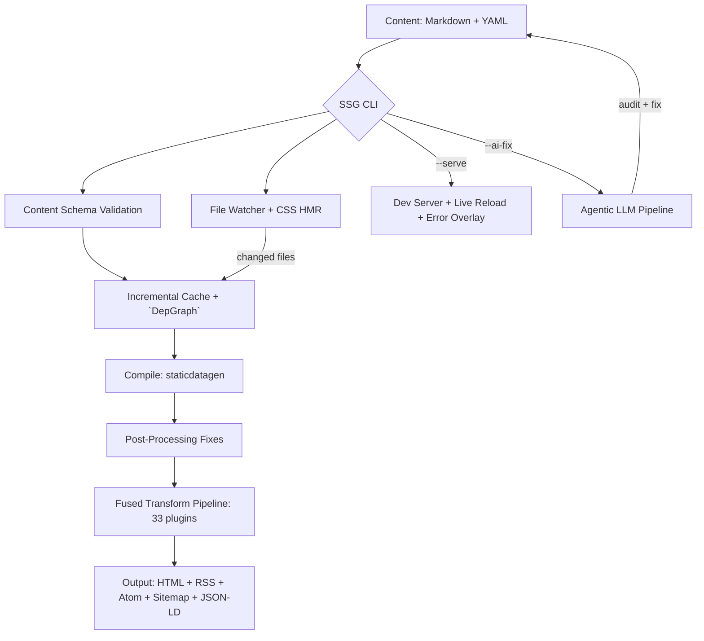

<!-- SPDX-License-Identifier: Apache-2.0 OR MIT -->

<p align="center">
  
</p>

<h1 align="center">Static Site Generator (SSG)</h1>

<p align="center">
  <strong>AI-augmented, accessibility-first static site generator built in Rust.</strong>
</p>

<p align="center">
  <a href="https://github.com/sebastienrousseau/static-site-generator/actions"></a>
  <a href="https://crates.io/crates/ssg"></a>
  <a href="https://docs.rs/ssg"></a>
  <a href="https://codecov.io/gh/sebastienrousseau/static-site-generator"></a>
  <a href="https://lib.rs/crates/ssg"></a>
</p>

---

## Contents

- [Install](#install) -- Cargo, Homebrew, apt, AUR, one-liner
- [Quick Start](#quick-start) -- scaffold a site in 30 seconds
- [Overview](#overview) -- what SSG does
- [Architecture](#architecture) -- build pipeline diagram
- [Benchmarks](#benchmarks) -- performance and test suite metrics
- [Features](#features) -- v0.0.38 capability matrix
- [The CLI](#the-cli) -- flags and usage
- [Library Usage](#library-usage) -- plugins, schemas, AI pipeline
- [Examples](#examples) -- 8 branded examples
- [Development](#development) -- make targets, CI workflows
- [Security](#security) -- safety guarantees and compliance
- [License](#license)

---

## Install

```toml
[dependencies]
ssg = "0.0.38"
```

### Prebuilt binaries

```sh
# macOS / Linux -- one command
curl -fsSL https://raw.githubusercontent.com/sebastienrousseau/static-site-generator/main/scripts/install.sh | sh

# Homebrew
brew install --formula https://raw.githubusercontent.com/sebastienrousseau/static-site-generator/main/packaging/homebrew/ssg.rb

# Cargo
cargo install ssg

# Debian / Ubuntu
sudo dpkg -i ssg_0.0.38_amd64.deb

# Arch Linux (AUR)
yay -S ssg

# Container
docker pull ghcr.io/sebastienrousseau/static-site-generator:latest
```

### Build from source

```bash
git clone https://github.com/sebastienrousseau/static-site-generator.git
cd static-site-generator
make          # check + clippy + test
```

Requires **Rust 1.88.0+**. Tested on Linux, macOS, and Windows.

---

## Quick Start

```bash
# 1 -- Install
cargo install ssg

# 2 -- Scaffold a new site
ssg -n mysite -c content -o build -t templates

# 3 -- Build
ssg -c content -o public -t templates

# 4 -- Development server with live reload
ssg -c content -o public -t templates -s public -w

# 5 -- AI-powered readability fix (requires Ollama)
ssg -c content -o public -t templates --ai-fix
```

---

## Overview

SSG generates static websites from Markdown content, YAML frontmatter, and `MiniJinja` templates. It compiles everything into production-ready HTML with built-in SEO metadata, WCAG 2.1 AA accessibility compliance, multilingual readability scoring, and feed generation. The 33-plugin pipeline handles the rest.

- **33-plugin pipeline** -- SEO, a11y, i18n, search, images, AI, CSP, JSON-LD, RSS, sitemaps
- **Agentic AI pipeline** -- audit, diagnose, fix, and verify content readability via local LLM
- **Multilingual readability** -- Flesch-Kincaid (EN), Kandel-Moles (FR), Wiener Sachtextformel (DE), Gulpease (IT), LIX (SV), Fernandez Huerta (ES)
- **Incremental builds** -- content fingerprinting via FNV-1a hashing and dependency graph
- **Streaming compilation** -- configurable memory budgets for 100K+ page sites
- **WCAG 2.1 AA** -- accessibility compliance validated on every build with axe-core CI
- **Zero unsafe code** -- `#![forbid(unsafe_code)]` across the entire codebase

---

## Architecture



---

## Benchmarks

| Metric | Value |
| :--- | :--- |
| **Source** | 39,103 lines across 38 modules |
| **Test suite** | 1,640 unit tests + 14 integration test suites |
| **Coverage** | 95% region, 97% line, 96% function |
| **Plugin pipeline** | 33 plugins, Rayon-parallelised |
| **Examples** | 8 branded examples |
| **Dependencies** | 15 runtime |
| **MSRV** | Rust 1.88.0 |

### Build performance

| Pages | Time | Memory |
|-------|------|--------|
| 100 | < 5s (CI-gated) | < 100 MB |
| 1,000 | < 10s | < 200 MB |
| 10,000 | Streaming batches | 512 MB budget |
| 100,000+ | Streaming compilation | Configurable via `--max-memory` |

Reproduce: `cargo bench --bench bench -- scalability`.

---

## Features

| | |
| :--- | :--- |
| **Performance** | Parallel file operations with Rayon, fused single-pass HTML transforms, content-addressed caching (FNV-1a), dependency graph for incremental rebuilds, streaming compilation for 100K+ pages, `--jobs N` thread control, `--max-memory MB` budget |
| **AI Pipeline** | Agentic LLM pipeline (`--ai-fix`): audit content readability, diagnose failing files, generate fixes via local LLM (Ollama), verify improvement, produce JSON report. Dry-run mode (`--ai-fix-dry-run`). Auto-generate alt text, meta descriptions, and JSON-LD via LLM |
| **Readability** | Multilingual scoring: Flesch-Kincaid (EN), Kandel-Moles (FR), Wiener Sachtextformel (DE), Gulpease (IT), LIX (SV/NO/DA), Fernandez Huerta (ES). BCP 47 language detection from frontmatter. CI readability gate |
| **Content** | Markdown with GFM extensions (tables, strikethrough, task lists), YAML/TOML/JSON frontmatter, typed content schemas with compile-time validation, shortcodes (youtube, gist, figure, admonition) |
| **SEO** | Meta description, Open Graph (title, description, type, url, image, locale), auto-generated OG social cards (SVG), Twitter Cards, canonical URLs, robots.txt, sitemaps with per-page lastmod |
| **Structured Data** | JSON-LD Article/WebPage with datePublished, dateModified, author, image, inLanguage, `BreadcrumbList` |
| **Syndication** | RSS 2.0 with enclosures and categories, Atom 1.0, Google News sitemap |
| **Accessibility** | WCAG 2.1 AA validation on every build, axe-core Playwright CI, decorative image detection, heading hierarchy, ARIA landmarks |
| **i18n** | Hreflang injection, `x-default` support, per-locale sitemaps, language switcher HTML |
| **Images** | Responsive `<picture>` with WebP sources, `srcset` at 320/640/1024/1440, lazy loading, CLS prevention |
| **Templates** | `MiniJinja` engine with inheritance, loops, conditionals, custom filters |
| **Search** | Client-side full-text search with modal UI, 28 locale translations, `Ctrl+K` / `Cmd+K` |
| **Security** | CSP build-time extraction (zero `unsafe-inline`), SRI hash generation, asset fingerprinting, path traversal prevention |
| **DX** | CSS hot reload, browser error overlay via WebSocket, file watching with change classification |
| **WebAssembly** | ssg-core + ssg-wasm compile to `wasm32-unknown-unknown` with wasm-bindgen |
| **Islands** | Web Components with lazy hydration (visible, idle, interaction) |

### Why SSG?

| Capability | SSG | Hugo | Zola | Astro |
|---|---|---|---|---|
| Agentic AI pipeline | Yes | No | No | No |
| Multilingual readability | Yes | No | No | No |
| Auto-generated OG images | Yes | No | No | Plugin |
| Built-in WCAG validation | Yes | No | No | No |
| CSP/SRI auto-extraction | Yes | No | No | Plugin |
| axe-core CI gate | Yes | No | No | No |
| WebAssembly target | Yes | No | No | N/A |
| 95% CI coverage floors | Yes | No | No | No |
| Zero unsafe code | Yes | Yes | Yes | N/A |

---

## The CLI

```text
Usage: ssg [OPTIONS]

Options:
  -f, --config <FILE>      Configuration file path
  -n, --new <NAME>         Create new project
  -c, --content <DIR>      Content directory
  -o, --output <DIR>       Output directory
  -t, --template <DIR>     Template directory
  -s, --serve <DIR>        Start development server
  -w, --watch              Watch for changes and rebuild
  -j, --jobs <N>           Rayon thread count (default: num_cpus)
      --max-memory <MB>    Peak memory budget for streaming (default: 512)
      --ai-fix             Run agentic AI pipeline to fix content readability
      --ai-fix-dry-run     Preview AI fixes without writing changes
      --validate           Validate content schemas and exit
      --drafts             Include draft pages in the build
      --deploy <TARGET>    Generate deployment config (netlify, vercel, cloudflare, github)
  -q, --quiet              Suppress non-error output
      --verbose            Show detailed build information
  -h, --help               Print help
  -V, --version            Print version
```

---

## Library Usage

<details>
<summary><b>Minimal pipeline</b></summary>

```rust,no_run
fn main() -> anyhow::Result<()> {
    ssg::run()
}
```

</details>

<details>
<summary><b>Custom plugin</b></summary>

```rust,no_run
use ssg::plugin::{Plugin, PluginContext, PluginManager};
use anyhow::Result;
use std::path::Path;

#[derive(Debug)]
struct LogPlugin;

impl Plugin for LogPlugin {
    fn name(&self) -> &str { "logger" }
    fn after_compile(&self, ctx: &PluginContext) -> Result<()> {
        println!("Site compiled to {:?}", ctx.site_dir);
        Ok(())
    }
}

fn main() -> Result<()> {
    let mut pm = PluginManager::new();
    pm.register(LogPlugin);
    pm.register(ssg::plugins::MinifyPlugin);

    let ctx = PluginContext::new(
        Path::new("content"),
        Path::new("build"),
        Path::new("public"),
        Path::new("templates"),
    );
    pm.run_after_compile(&ctx)?;
    Ok(())
}
```

</details>

<details>
<summary><b>Content schema validation</b></summary>

Create `content/content.schema.toml`:

```toml
[[schemas]]
name = "post"

[[schemas.fields]]
name = "title"
type = "string"
required = true

[[schemas.fields]]
name = "date"
type = "date"
required = true

[[schemas.fields]]
name = "draft"
type = "bool"
default = "false"
```

Pages with `schema = "post"` in their frontmatter are validated at compile time. Run `ssg --validate` for schema-only checks.

</details>

<details>
<summary><b>Readability audit</b></summary>

```rust,no_run
use ssg::llm::{LlmPlugin, LlmConfig};
use std::path::Path;

let report = LlmPlugin::audit_all(Path::new("content"), 8.0).unwrap();
println!("{}/{} files pass grade 8.0", report.passing, report.total_files);

// Multilingual: French content uses Kandel-Moles automatically
// when frontmatter contains `language: fr`
```

</details>

<details>
<summary><b>OG image generation</b></summary>

```rust,no_run
use ssg::og_image::generate_og_svg;

let svg = generate_og_svg("My Page Title", "My Site", "#1a1a2e", "#ffffff");
std::fs::write("og-card.svg", svg).unwrap();
// 1200x630 SVG social card ready for og:image
```

</details>

---

## Examples

Run any example:

```bash
cargo run --example basic
cargo run --example blog
```

| Example | Purpose |
| :--- | :--- |
| `basic` | Minimal site with SEO, search, and fused transforms |
| `quickstart` | Scaffold and build in 10 lines |
| `multilingual` | Multi-locale site with hreflang and per-locale sitemaps |
| `plugins` | Full plugin pipeline demo with `DepGraph` API |
| `blog` | EAA-compliant accessibility-first blog with dual feeds |
| `docs` | Documentation portal with schema validation and syntax highlighting |
| `landing` | Zero-JS landing page with CSP hardening |
| `portfolio` | Developer portfolio with JSON-LD and Atom feed |

---

## Development

```bash
make              # check + clippy + test
make test         # run all tests
make bench        # run Criterion benchmarks
make lint         # lint with Clippy
make format       # format with rustfmt
make deny         # supply-chain audit
make doc          # build API documentation
make a11y         # run pa11y accessibility audit
make clean        # remove build artifacts
```

### CI

| Workflow | Trigger | Purpose |
| :--- | :--- | :--- |
| `ci.yml` | push, PR | fmt, clippy, test (3 OS), coverage (95% floor), cargo-deny |
| `document.yml` | push to main | Build and deploy API docs to GitHub Pages |
| `release.yml` | tag `v*` | Cross-platform binaries, GHCR container, crates.io, AUR |
| `scheduled.yml` | weekly, tag | Multi-OS portability, pa11y a11y, `CycloneDX` SBOM, benchmarks |
| `visual.yml` | PR | Playwright screenshots (3 viewports) + axe-core WCAG 2.1 AA |
| `wasm.yml` | push, PR | Build and test ssg-core + ssg-wasm for wasm32 |
| `readability-gate.yml` | PR | Flesch-Kincaid audit on docs and content |

See [CONTRIBUTING.md](CONTRIBUTING.md) for signed commits and PR guidelines.

---

## Security

<details>
<summary><b>Safety guarantees and compliance</b></summary>

- `#![forbid(unsafe_code)]` across the entire codebase
- CSP build-time extraction: all inline styles and scripts moved to external files with SRI hashes. Zero `unsafe-inline`
- Path traversal prevention with `..` detection and symlink rejection
- File size limits and directory depth bounds
- `cargo audit` with zero advisories
- `cargo deny` -- license, advisory, ban, and source checks
- `CycloneDX` SBOM generated as release artifact with Sigstore attestation
- SPDX license headers on all source files
- Signed commits enforced via SSH ED25519

See [docs/whitepaper/csp-without-compromise.md](docs/whitepaper/csp-without-compromise.md) for the full CSP security architecture.

</details>

<details>
<summary><b>All 38 modules</b></summary>

| Module | Purpose |
| :--- | :--- |
| `accessibility` | WCAG 2.1 AA checker, ARIA validation, decorative image detection |
| `ai` | AI-readiness hooks, alt-text validation, `llms.txt` / `llms-full.txt` generation |
| `assets` | Asset fingerprinting and SRI hash generation |
| `cache` | Content fingerprinting (FNV-1a) for incremental builds |
| `cmd` | CLI argument parsing, `SsgConfig`, input validation |
| `content` | Content schemas, `ContentValidationPlugin`, `--validate` |
| `csp` | CSP build-time extraction of inline styles/scripts to external files |
| `depgraph` | Page-to-template dependency graph for incremental rebuilds |
| `deploy` | Netlify, Vercel, Cloudflare Pages, GitHub Pages adapters |
| `drafts` | Draft content filtering |
| `frontmatter` | Frontmatter extraction and `.meta.json` sidecars |
| `fs_ops` | Safe file operations with traversal prevention |
| `highlight` | Syntax highlighting for code blocks |
| `i18n` | Hreflang injection, per-locale sitemaps, language switcher |
| `image_plugin` | Responsive `<picture>` with WebP, srcset generation |
| `islands` | Web Components with lazy hydration |
| `livereload` | WebSocket live-reload, CSS HMR, browser error overlay |
| `llm` | Local LLM pipeline (Ollama), multilingual readability scoring, agentic fix |
| `logging` | Structured logging configuration |
| `markdown_ext` | GFM tables, strikethrough, task lists |
| `og_image` | Auto-generated OG social card SVGs |
| `pagination` | Pagination plugin for listing pages |
| `pipeline` | Build orchestration, plugin registration, `RunOptions` |
| `plugin` | `Plugin` trait with lifecycle hooks, `PluginManager`, `PluginCache` |
| `plugins` | `MinifyPlugin`, `ImageOptiPlugin`, `DeployPlugin` |
| `postprocess` | Sitemap, RSS, Atom, manifest, HTML post-processing fixes |
| `process` | Directory creation and site processing |
| `scaffold` | Project scaffolding (`ssg --new`) |
| `schema` | JSON Schema generator for configuration |
| `search` | Full-text search index, modal UI, 28 locale translations |
| `seo` | `SeoPlugin`, `JsonLdPlugin`, `CanonicalPlugin`, `RobotsPlugin` |
| `server` | Development HTTP server |
| `shortcodes` | youtube, gist, figure, admonition expansion |
| `stream` | High-performance streaming file processor |
| `streaming` | Memory-budgeted streaming compilation for large sites |
| `taxonomy` | Tag and category index generation |
| `template_engine` | `MiniJinja` templating engine integration |
| `template_plugin` | `MiniJinja` template rendering plugin |
| `walk` | Shared bounded directory walkers |
| `watch` | Polling-based file watcher with change classification |

</details>

---

## License

Dual-licensed under [Apache 2.0](https://www.apache.org/licenses/LICENSE-2.0) or [MIT](https://opensource.org/licenses/MIT), at your option.

See [CHANGELOG.md](CHANGELOG.md) for release history.

<p align="right"><a href="#contents">Back to Top</a></p>
