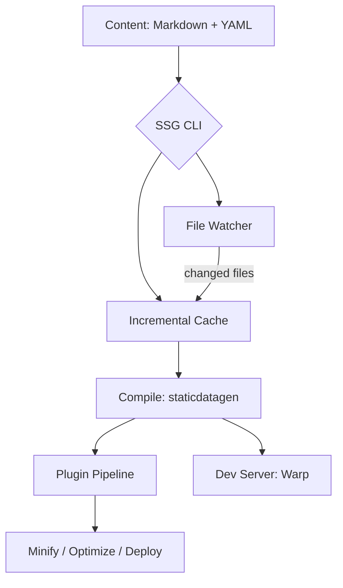

<p align="center">
  
</p>

<h1 align="center">Static Site Generator (SSG)</h1>

<p align="center">
  <strong>Fast, memory-safe, and extensible — built in Rust.</strong>
</p>

<p align="center">
  <a href="https://github.com/sebastienrousseau/shokunin/actions"></a>
  <a href="https://crates.io/crates/ssg"></a>
  <a href="https://docs.rs/ssg"></a>
  <a href="https://codecov.io/gh/sebastienrousseau/shokunin"></a>
  <a href="https://lib.rs/crates/ssg"></a>
</p>

---

## Install

```bash
cargo install ssg
```

Or add as a library dependency:

```toml
[dependencies]
ssg = "0.0.34"
```

You need [Rust](https://rustup.rs/) 1.74.0 or later. Works on macOS, Linux, and Windows.

---

## Overview

SSG generates static websites from Markdown content, YAML frontmatter, and HTML templates. It compiles everything into production-ready HTML with built-in SEO metadata, accessibility compliance, and feed generation. The plugin system handles the rest.

- **Zero-cost performance** through Rust's ownership model and parallel file operations
- **Incremental builds** with content fingerprinting — only changed files are reprocessed
- **File watching** with automatic rebuild on content changes
- **Plugin architecture** with lifecycle hooks for custom processing
- **WCAG 2.1 Level AA** accessibility compliance in generated output

---

## Architecture



---

## Features

| | |
| :--- | :--- |
| **Performance** | Parallel file operations with Rayon, iterative traversal with depth bounds, incremental builds |
| **Content** | Markdown, YAML frontmatter, JSON, TOML. Atom and RSS feed generation |
| **SEO** | Meta tags, Open Graph, sitemaps, structured data, canonical URLs |
| **Accessibility** | Automatic WCAG 2.1 Level AA compliance |
| **Theming** | Custom HTML templates with variable substitution |
| **Plugins** | Lifecycle hooks: `before_compile`, `after_compile`, `on_serve`. Built-in minify, image-opti, deploy |
| **Watch mode** | Polling-based file watcher with configurable interval |
| **Caching** | Content fingerprinting via `.ssg-cache.json` for fast rebuilds |
| **Config** | TOML config files with JSON Schema for IDE autocomplete (`ssg.schema.json`) |
| **Security** | `#![forbid(unsafe_code)]`, path traversal prevention, symlink rejection, file size limits |
| **CI** | Multi-platform test matrix (macOS, Linux, Windows), cargo audit, cargo deny, SBOM generation |

---

## The CLI

| Command | What it does |
| :--- | :--- |
| `ssg -n mysite -c content -o build -t templates` | Generate a site from source directories |
| `ssg --config config.toml` | Load configuration from a TOML file |
| `ssg --serve public` | Serve from a specific directory |
| `ssg --watch` | Watch content for changes and rebuild |

<details>
<summary><b>Full CLI reference</b></summary>

```text
Usage: ssg [OPTIONS]

Options:
  -f, --config <FILE>   Configuration file path
  -n, --new <NAME>      Create new project
  -c, --content <DIR>   Content directory
  -o, --output <DIR>    Output directory
  -t, --template <DIR>  Template directory
  -s, --serve <DIR>     Development server directory
  -w, --watch           Watch for changes
  -h, --help            Print help
  -V, --version         Print version
```

When no flags are provided, sensible defaults are used (`content/`, `public/`, `templates/`).

</details>

---

## First 5 Minutes

```bash
# 1. Install
cargo install ssg

# 2. Create a site
ssg -n mysite -c content -o build -t templates

# 3. Or run the examples
git clone https://github.com/sebastienrousseau/shokunin.git
cd shokunin
cargo run --example basic
cargo run --example quickstart
cargo run --example multilingual
```

---

## Library Usage

```rust,no_run
use staticdatagen::compiler::service::compile;
use std::path::Path;

fn main() -> anyhow::Result<()> {
    let build_dir = Path::new("build");
    let content_dir = Path::new("content");
    let site_dir = Path::new("public");
    let template_dir = Path::new("templates");

    compile(build_dir, content_dir, site_dir, template_dir)?;
    println!("Site generated successfully!");
    Ok(())
}
```

<details>
<summary><b>Plugin example</b></summary>

```rust
use ssg::plugin::{Plugin, PluginContext, PluginManager};
use anyhow::Result;
use std::path::Path;

#[derive(Debug)]
struct LogPlugin;

impl Plugin for LogPlugin {
    fn name(&self) -> &str { "logger" }
    fn after_compile(&self, ctx: &PluginContext) -> Result<()> {
        println!("Site compiled to {:?}", ctx.site_dir);
        Ok(())
    }
}

let mut pm = PluginManager::new();
pm.register(LogPlugin);
pm.register(ssg::plugins::MinifyPlugin);

let ctx = PluginContext::new(
    Path::new("content"),
    Path::new("build"),
    Path::new("public"),
    Path::new("templates"),
);
pm.run_after_compile(&ctx).unwrap();
```

</details>

<details>
<summary><b>Incremental build example</b></summary>

```rust,no_run
use ssg::cache::BuildCache;
use std::path::Path;

let cache_path = Path::new(".ssg-cache.json");
let content_dir = Path::new("content");

let mut cache = BuildCache::load(cache_path).unwrap();
let changed = cache.changed_files(content_dir).unwrap();

if changed.is_empty() {
    println!("No changes detected, skipping build.");
} else {
    println!("Rebuilding {} changed files", changed.len());
    // ... run build ...
    cache.update(content_dir).unwrap();
    cache.save().unwrap();
}
```

</details>

---

## Benchmarks

| Metric | Value |
| :--- | :--- |
| **Release binary** | ~5 MB (stripped, LTO) |
| **Unsafe code** | 0 blocks — `#![forbid(unsafe_code)]` enforced |
| **Test suite** | 342 tests in < 2 seconds |
| **Dependencies** | 19 direct, all audited |
| **Coverage** | 98% library line coverage |

---

## Development

```bash
make build        # Build the project
make test         # Run all tests
make lint         # Lint with Clippy
make format       # Format with rustfmt
make deny         # Check licenses and advisories
```

See [CONTRIBUTING.md](CONTRIBUTING.md) for setup, signed commits, and PR guidelines.

---

## What's Included

<details>
<summary><b>Core modules</b></summary>

- **cmd** — CLI argument parsing, configuration management, input validation
- **process** — Directory creation, frontmatter preprocessing, site compilation
- **plugin** — Trait-based plugin system with lifecycle hooks
- **plugins** — Built-in `MinifyPlugin`, `ImageOptiPlugin`, `DeployPlugin`
- **cache** — Content fingerprinting for incremental builds
- **watch** — Polling-based file watcher for live rebuild
- **schema** — JSON Schema generator for configuration
</details>

<details>
<summary><b>Security and compliance</b></summary>

- **`#![forbid(unsafe_code)]`** across the entire codebase
- **Path traversal prevention** with `..` detection and symlink rejection
- **File size limits** (10 MB per file) and directory depth bounds (128 levels)
- **`cargo audit`** with zero warnings — all advisories tracked in `.cargo/audit.toml`
- **`cargo deny`** — license, advisory, ban, and source checks all pass
- **SBOM** generated as a release artifact
- **Signed commits** enforced via SSH ED25519
</details>

<details>
<summary><b>Test coverage</b></summary>

- **342 total tests** (197 unit + 23 doc-tests + 36 integration + 86 `serde_yml`)
- **98% library line coverage** measured with cargo-llvm-cov
- **Multi-platform CI** — macOS, Ubuntu, Windows (stable + nightly)
</details>

---

**THE ARCHITECT** ᛫ [Sebastien Rousseau](https://sebastienrousseau.com)
**THE ENGINE** ᛞ [EUXIS](https://euxis.co) ᛫ Enterprise Unified Execution Intelligence System

---

## License

Dual-licensed under [Apache 2.0](https://www.apache.org/licenses/LICENSE-2.0) or [MIT](https://opensource.org/licenses/MIT), at your option.

<p align="right"><a href="#static-site-generator-ssg">Back to Top</a></p>
