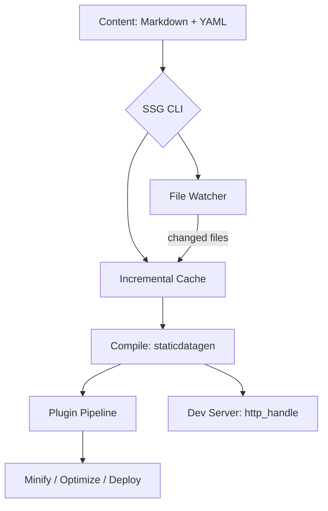

<p align="center">
  
</p>

<h1 align="center">Static Site Generator (SSG)</h1>

<p align="center">
  <strong>Fast, memory-safe, and extensible — built in Rust.</strong>
</p>

<p align="center">
  <a href="https://github.com/sebastienrousseau/shokunin/actions"></a>
  <a href="https://crates.io/crates/ssg"></a>
  <a href="https://docs.rs/ssg"></a>
  <a href="https://codecov.io/gh/sebastienrousseau/shokunin"></a>
  <a href="https://lib.rs/crates/ssg"></a>
</p>

---

## Contents

- [Install](#install) — prerequisites, crate, library dependency
- [Overview](#overview) — what SSG does
- [Architecture](#architecture) — build pipeline diagram
- [Features](#features) — capability matrix
- [The CLI](#the-cli) — flags and usage
- [First 5 Minutes](#first-5-minutes) — clone → tests passing
- [Library Usage](#library-usage) — `ssg::run()`, plugins, incremental builds
- [Benchmarks](#benchmarks) — binary size, test suite, coverage
- [Development](#development) — make targets, contributing
- [What's Included](#whats-included) — modules, security, tests
- [License](#license)

---

## Install

### Prerequisites

| Platform | Setup |
| :--- | :--- |
| **macOS** | `brew install rustup-init && rustup-init -y`, or follow [rustup.rs](https://rustup.rs/) |
| **Linux / WSL** | `curl --proto '=https' --tlsv1.2 -sSf https://sh.rustup.rs \| sh` |
| **Windows (native)** | Download [`rustup-init.exe`](https://win.rustup.rs/). Native build is supported; the `make` targets below require Git Bash or WSL |

SSG requires **Rust 1.88.0 or later** (pinned in `rust-toolchain.toml`). Verify with `rustc --version`.

### Crate

```bash
cargo install ssg
```

Or add as a library dependency:

```toml
[dependencies]
ssg = "0.0.35"
```

---

## Overview

SSG generates static websites from Markdown content, YAML frontmatter, and HTML templates. It compiles everything into production-ready HTML with built-in SEO metadata, accessibility compliance, and feed generation. The plugin system handles the rest.

- **Zero-cost performance** through Rust's ownership model and parallel file operations
- **Incremental builds** with content fingerprinting — only changed files are reprocessed
- **File watching** with automatic rebuild on content changes
- **Plugin architecture** with lifecycle hooks for custom processing
- **WCAG 2.1 Level AA** accessibility compliance in generated output

---

## Architecture



---

## Features

| | |
| :--- | :--- |
| **Performance** | Parallel file operations with Rayon, iterative traversal with depth bounds, incremental builds |
| **Content** | Markdown, YAML frontmatter, JSON, TOML. Atom and RSS feed generation |
| **SEO** | Meta tags, Open Graph, sitemaps, structured data, canonical URLs |
| **Accessibility** | Automatic WCAG 2.1 Level AA compliance |
| **Theming** | Custom HTML templates with variable substitution |
| **Plugins** | Lifecycle hooks: `before_compile`, `after_compile`, `on_serve`. Built-in minify, image-opti, deploy |
| **Watch mode** | Polling-based file watcher with configurable interval |
| **Caching** | Content fingerprinting via `.ssg-cache.json` for fast rebuilds |
| **Config** | TOML config files with JSON Schema for IDE autocomplete (`ssg.schema.json`) |
| **Security** | `#![forbid(unsafe_code)]`, path traversal prevention, symlink rejection, file size limits |
| **CI** | Shared `rust-ci.yml` pipeline on `stable` toolchain, plus `cargo audit`, `cargo deny`, dependency review and SBOM generation |

---

## The CLI

| Command | What it does |
| :--- | :--- |
| `ssg -n mysite -c content -o build -t templates` | Generate a site from source directories |
| `ssg --config config.toml` | Load configuration from a TOML file |
| `ssg --serve public` | Serve from a specific directory |
| `ssg --watch` | Watch content for changes and rebuild |

<details>
<summary><b>Full CLI reference</b></summary>

```text
Usage: ssg [OPTIONS]

Options:
  -f, --config <FILE>    Configuration file path
  -n, --new <NAME>       Create new project
  -c, --content <DIR>    Content directory
  -o, --output <DIR>     Output directory
  -t, --template <DIR>   Template directory
  -s, --serve <DIR>      Development server directory
  -w, --watch            Watch for changes and rebuild
      --drafts           Include draft pages in the build
      --deploy <TARGET>  Generate deployment config (netlify, vercel, cloudflare, github)
  -q, --quiet            Suppress non-error output
      --verbose          Show detailed build information
  -h, --help             Print help
  -V, --version          Print version
```

When no flags are provided, sensible defaults are used (`content/`, `public/`, `templates/`).

</details>

---

## First 5 Minutes

```bash
# 1 — Install
cargo install ssg                       # macOS / Linux / Windows

# 2 — Scaffold + build a brand-new site
ssg -n mysite -c content -o build -t templates

# 3 — Or build from source and run the bundled examples
git clone https://github.com/sebastienrousseau/shokunin.git
cd shokunin
cargo build                             # ~2 min cold, < 10 s incremental
cargo test --lib                        # 741 tests, ~8 s on M-series Mac
cargo run --example basic               # minimal site
cargo run --example quickstart          # opinionated defaults
cargo run --example plugins             # plugin pipeline walk-through
cargo run --example multilingual        # 28 locales + localized search
```

> On **WSL/Linux** the same commands work verbatim. On **native Windows**, replace `make` targets with their `cargo` equivalents (see [*Development*](#development)).

### One-command bootstrap

```bash
make init       # detects platform, installs rustfmt + clippy + cargo-deny,
                # wires up the signed-commit git hook, and runs cargo build
```

### WSL2 troubleshooting

The bundled dev server binds to `127.0.0.1:3000` (or `:8000` for the CLI). On WSL2, that loopback is reachable from your Windows host as long as `localhostForwarding` is enabled (the default since the Microsoft Store version of WSL). If your browser can't reach the site, override the bind address with environment variables — no code changes needed:

```bash
SSG_HOST=0.0.0.0 SSG_PORT=8080 cargo run --example multilingual
```

The same vars work for `ssg --serve`. Use `0.0.0.0` for Codespaces, dev-containers, and any remote-dev setup where the listener needs to be reachable from outside its network namespace.

---

## Library Usage

```rust,no_run
// The simplest path: delegate to ssg's own pipeline.
#[tokio::main]
async fn main() -> anyhow::Result<()> {
    ssg::run().await
}
```

If you only want the compile primitive (no plugin pipeline, no dev server), depend on [`staticdatagen`](https://crates.io/crates/staticdatagen) directly:

```rust,no_run
use staticdatagen::compiler::service::compile;
use std::path::Path;

fn main() -> anyhow::Result<()> {
    compile(
        Path::new("build"),
        Path::new("content"),
        Path::new("public"),
        Path::new("templates"),
    )?;
    Ok(())
}
```

<details>
<summary><b>Plugin example</b></summary>

```rust,no_run
use ssg::plugin::{Plugin, PluginContext, PluginManager};
use anyhow::Result;
use std::path::Path;

#[derive(Debug)]
struct LogPlugin;

impl Plugin for LogPlugin {
    fn name(&self) -> &str { "logger" }
    fn after_compile(&self, ctx: &PluginContext) -> Result<()> {
        println!("Site compiled to {:?}", ctx.site_dir);
        Ok(())
    }
}

fn main() -> Result<()> {
    let mut pm = PluginManager::new();
    pm.register(LogPlugin);
    pm.register(ssg::plugins::MinifyPlugin);

    let ctx = PluginContext::new(
        Path::new("content"),
        Path::new("build"),
        Path::new("public"),
        Path::new("templates"),
    );
    pm.run_after_compile(&ctx)?;
    Ok(())
}
```

</details>

<details>
<summary><b>Incremental build example</b></summary>

```rust,no_run
use ssg::cache::BuildCache;
use std::path::Path;

let cache_path = Path::new(".ssg-cache.json");
let content_dir = Path::new("content");

let mut cache = BuildCache::load(cache_path).unwrap();
let changed = cache.changed_files(content_dir).unwrap();

if changed.is_empty() {
    println!("No changes detected, skipping build.");
} else {
    println!("Rebuilding {} changed files", changed.len());
    // ... run build ...
    cache.update(content_dir).unwrap();
    cache.save().unwrap();
}
```

</details>

---

## Benchmarks

| Metric | Value |
| :--- | :--- |
| **Release binary** | ~5 MB (stripped, LTO) |
| **Unsafe code** | 0 blocks — `#![forbid(unsafe_code)]` enforced |
| **Test suite** | **741 lib tests** — verified `cargo test --lib` on `feat/v0.0.35`, runs in ~8 s on M-series Mac |
| **Dependencies** | Audited via `cargo audit` and `cargo deny check` (run `make deny` to reproduce) |
| **Coverage** | ~98 % line coverage, measured with `cargo llvm-cov` |

---

## Development

```bash
make build        # Build the project
make test         # Run all tests
make lint         # Lint with Clippy
make format       # Format with rustfmt
make deny         # Check licenses and advisories
```

See [CONTRIBUTING.md](CONTRIBUTING.md) for setup, signed commits, and PR guidelines.

---

## What's Included

<details>
<summary><b>Core modules</b></summary>

- **cmd** — CLI argument parsing, `SsgConfig`, input validation
- **process** — Argument-driven site processing and directory creation
- **lib** — Orchestrator: `run()` → plugin pipeline → compile → serve
- **plugin** — `Plugin` trait with `before_compile`, `after_compile`, `on_serve` hooks
- **plugins** — Built-in `MinifyPlugin`, `ImageOptiPlugin`, `DeployPlugin`
- **cache** — Content fingerprinting for incremental builds
- **watch** — Polling-based file watcher for live rebuild
- **schema** — JSON Schema generator for configuration
- **scaffold** — Project scaffolding (`ssg --new`)
- **frontmatter** — Frontmatter extraction and `.meta.json` sidecar support
- **tera_engine** — Tera templating engine integration
- **tera_plugin** — Tera template rendering plugin
- **seo** — `SeoPlugin`, `JsonLdPlugin`, `CanonicalPlugin`, `RobotsPlugin`
- **search** — Client-side search index generation + localized `SearchLabels`
- **accessibility** — Automated WCAG checker and ARIA validation
- **ai** — AI-readiness content hooks (alt-text validation, `llms.txt`)
- **deploy** — Deployment adapters (Netlify, Vercel, Cloudflare, GitHub Pages)
- **assets** — Asset fingerprinting and SRI hash generation
- **highlight** — Syntax highlighting plugin for code blocks
- **shortcodes** — Shortcode expansion (youtube, gist, figure, admonitions)
- **markdown_ext** — GFM extensions (tables, strikethrough, task lists)
- **image_plugin** — Image optimization with WebP output and responsive `srcset`
- **livereload** — WebSocket live-reload injection
- **pagination** — Pagination plugin for listing pages
- **taxonomy** — Taxonomy generation (tags, categories)
- **drafts** — Draft content filtering plugin
- **stream** — High-performance streaming file processor
- **walk** — Shared bounded directory walkers
</details>

<details>
<summary><b>Security and compliance</b></summary>

- **`#![forbid(unsafe_code)]`** across the entire codebase
- **Path traversal prevention** with `..` detection and symlink rejection
- **File size limits** (10 MB per file) and directory depth bounds (128 levels)
- **`cargo audit`** with zero warnings — all advisories tracked in `.cargo/audit.toml`
- **`cargo deny`** — license, advisory, ban, and source checks all pass
- **SBOM** generated as a release artifact
- **Signed commits** enforced via SSH ED25519
</details>

<details>
<summary><b>Test coverage</b></summary>

- **741 lib tests** plus integration + fault-injection suites
- **~98 % library line coverage** measured with cargo-llvm-cov
- CI runs on the shared `rust-ci.yml` pipeline (`stable` toolchain)
</details>

---

**THE ARCHITECT** ᛫ [Sebastien Rousseau](https://sebastienrousseau.com)
**THE ENGINE** ᛞ [EUXIS](https://euxis.co) ᛫ Enterprise Unified Execution Intelligence System

---

## Code of Conduct

Please read our [Code of Conduct](.github/CODE-OF-CONDUCT.md) before participating in the project.

## License

Dual-licensed under [Apache 2.0](https://www.apache.org/licenses/LICENSE-2.0) or [MIT](https://opensource.org/licenses/MIT), at your option.

See [CHANGELOG.md](CHANGELOG.md) for release history.

<p align="right"><a href="#contents">Back to Top</a></p>
