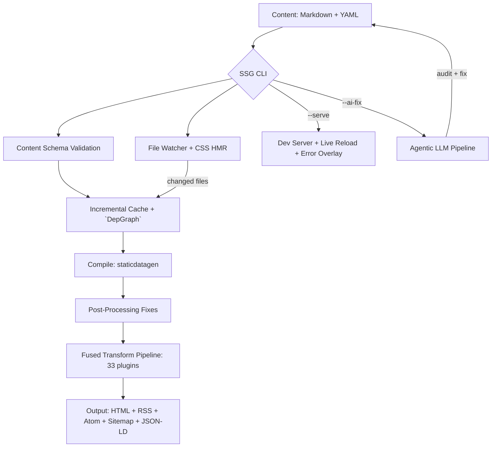

<!-- SPDX-License-Identifier: Apache-2.0 OR MIT -->

<p align="center">
  
</p>

<h1 align="center">Static Site Generator (SSG)</h1>

<p align="center">
  <strong>AI-augmented, accessibility-first static site generator built in Rust.</strong>
</p>

<p align="center">
  <a href="https://github.com/sebastienrousseau/static-site-generator/actions"></a>
  <a href="https://crates.io/crates/ssg"></a>
  <a href="https://docs.rs/ssg"></a>
  <a href="https://codecov.io/gh/sebastienrousseau/static-site-generator"></a>
  <a href="https://lib.rs/crates/ssg"></a>
</p>

---

## Contents

- [Install](#install) -- Cargo, Homebrew, apt, AUR, one-liner
- [Quick Start](#quick-start) -- scaffold a site in 30 seconds
- [Overview](#overview) -- what SSG does
- [Architecture](#architecture) -- build pipeline diagram
- [Benchmarks](#benchmarks) -- performance and test suite metrics
- [Features](#features) -- v0.0.47 capability matrix
- [The CLI](#the-cli) -- flags and usage
- [Library Usage](#library-usage) -- plugins, schemas, AI pipeline
- [Examples](#examples) -- 8 branded examples
- [Development](#development) -- make targets, CI workflows
- [Security](#security) -- safety guarantees and compliance
- [License](#license)

---

## Install

```toml
[dependencies]
ssg = "0.0.49"
```

### Prebuilt binaries

```sh
# macOS / Linux -- one command
curl -fsSL https://raw.githubusercontent.com/sebastienrousseau/static-site-generator/main/scripts/install.sh | sh

# Homebrew
brew install --formula https://raw.githubusercontent.com/sebastienrousseau/static-site-generator/main/packaging/homebrew/ssg.rb

# Cargo
cargo install ssg

# Debian / Ubuntu
sudo dpkg -i ssg_0.0.47_amd64.deb

# Arch Linux (AUR)
yay -S ssg

# Container
docker pull ghcr.io/sebastienrousseau/static-site-generator:latest
```

### Build from source

```bash
git clone https://github.com/sebastienrousseau/static-site-generator.git
cd static-site-generator
make          # check + clippy + test
```

Requires **Rust 1.88.0+**. Tested on Linux, macOS, and Windows.

---

## Quick Start

```bash
# 1 -- Install
cargo install ssg

# 2 -- Scaffold a new site
ssg -n mysite -c content -o build -t templates

# 3 -- Build
ssg -c content -o public -t templates

# 4 -- Development server with live reload
ssg -c content -o public -t templates -s public -w

# 5 -- AI-powered readability fix (requires Ollama)
ssg -c content -o public -t templates --ai-fix
```

---

## Overview

SSG generates static websites from Markdown content, YAML frontmatter, and `MiniJinja` templates. It compiles everything into production-ready HTML with built-in SEO metadata, WCAG 2.2 AA accessibility compliance (including the new 2.5.8, 2.4.13, 3.2.6 criteria where automatable), multilingual readability scoring, and feed generation. The 33-plugin pipeline handles the rest.

- **33-plugin pipeline** -- SEO, a11y, i18n, search, images, AI, CSP, JSON-LD, RSS, sitemaps
- **Agentic AI pipeline** -- audit, diagnose, fix, and verify content readability via local LLM
- **Multilingual readability** -- Flesch-Kincaid (EN), Kandel-Moles (FR), Wiener Sachtextformel (DE), Gulpease (IT), LIX (SV), Fernandez Huerta (ES)
- **Incremental builds** -- content fingerprinting via FNV-1a hashing and dependency graph
- **Bounded-memory batch compilation** -- configurable memory budgets for 100K+ page sites
- **WCAG 2.2 AA** -- accessibility checked on every build (non-blocking by default; reports written to `accessibility-report.json` + `wcag-compliance.json`) and gated in CI by axe-core. Build-failure on a11y violations is opt-in via the `STRICT_A11Y` env var (implemented in v0.0.40)
- **Zero unsafe code** -- `#![forbid(unsafe_code)]` across the entire codebase

---

## Architecture


```mermaid
graph TD
    A[Content: Markdown + YAML] --> B{SSG CLI}
    B --> V[Content Schema Validation]
    V --> C[Incremental Cache + `DepGraph`]
    C --> D[Compile: staticdatagen]
    D --> E[Post-Processing Fixes]
    E --> F[Fused Transform Pipeline: 33 plugins]
    F --> G[Output: HTML + RSS + Atom + Sitemap + JSON-LD]
    B --> H[File Watcher + CSS HMR]
    H -->|changed files| C
    B -->|--serve| S[Dev Server + Live Reload + Error Overlay]
    B -->|--ai-fix| AI[Agentic LLM Pipeline]
    AI -->|audit + fix| A
```

---

## Benchmarks

| Metric | Value |
| :--- | :--- |
| **Source** | 71,000+ lines across 7 workspace crates (`ssg`, `ssg-core`, `ssg-a11y`, `ssg-search`, `ssg-rpc`, `ssg-rpc-macro`, `ssg-wasm`) |
| **Test suite** | 3,489 unit tests + 36 integration test suites |
| **Coverage** | 95% region, 95% line, 95% function (CI-gated) |
| **Plugin pipeline** | 38 plugins, Rayon-parallelised |
| **Audit gates** | 15 (WCAG 2.2 AAA, JSON-LD, hreflang, lang consistency, CSP+SRI, PQC TLS, HTML5, broken links, OG, markdown lint, perf budget, AI discovery, RSS/Atom, image opt, search index integrity) |
| **Examples** | 8 branded sites + 2 edge-runtime adapters (Cloudflare Workers, Vercel Edge) |
| **Edge runtimes** | Cloudflare Workers + Vercel Edge with ISR (`ssg-wasm`) |
| **Search** | Browser-native int8 vector embeddings via `ssg-search` (WASM, ≤2 MB gzipped budget) |
| **MSRV** | Rust 1.88.0 |

### Build performance

| Pages | Time | Memory |
|-------|------|--------|
| 100 | < 5s (CI-gated) | < 100 MB |
| 1,000 | < 10s | < 200 MB |
| 10,000 | Bounded-memory batches | 512 MB budget |
| 100,000+ | Bounded-memory batches | Configurable via `--max-memory` |

Reproduce: `cargo bench --bench bench -- scalability`.

---

## Features

| | |
| :--- | :--- |
| **Performance** | Parallel file operations with Rayon, fused single-pass HTML transforms, content-addressed caching (FNV-1a), dependency graph for incremental rebuilds, bounded-memory batch compilation for 100K+ pages, `--jobs N` thread control, `--max-memory MB` budget |
| **AI Pipeline** | Agentic LLM pipeline (`--ai-fix`): audit content readability, diagnose failing files, generate fixes via local LLM (Ollama), verify improvement, produce JSON report. Dry-run mode (`--ai-fix-dry-run`). Auto-generate alt text, meta descriptions, and JSON-LD via LLM |
| **Readability** | Multilingual scoring: Flesch-Kincaid (EN), Kandel-Moles (FR), Wiener Sachtextformel (DE), Gulpease (IT), LIX (SV/NO/DA), Fernandez Huerta (ES). BCP 47 language detection from frontmatter. CI readability gate |
| **Content** | Markdown with GFM extensions (tables, strikethrough, task lists), YAML/TOML/JSON frontmatter, typed content schemas with compile-time validation, shortcodes (youtube, gist, figure, admonition), compile-time word count + estimated reading time injected into `.meta.json` sidecars |
| **SEO** | Meta description, Open Graph (title, description, type, url, image, locale), auto-generated OG social cards (SVG), Twitter Cards, canonical URLs, robots.txt, sitemaps with per-page lastmod, first-class topic-cluster taxonomy (hub + pillar indexes), related-post discovery via `Jaccard` tag/category overlap |
| **Structured Data** | JSON-LD Article/WebPage with datePublished, dateModified, author, image, inLanguage, `BreadcrumbList` |
| **Syndication** | RSS 2.0 with enclosures and categories, Atom 1.0, Google News sitemap |
| **Accessibility** | WCAG 2.2 AA validation on every build (1.1.1, 1.3.1, 2.3.1, 2.4.4, 2.4.13, 2.5.8, 3.1.1, 3.2.6), axe-core Playwright CI, decorative image detection, heading hierarchy, ARIA landmarks; emits `wcag-compliance.json` matrix ([WCAG 2.2 + EAA guide](docs/guide/wcag-compliance.md)) |
| **i18n** | Hreflang injection, `x-default` support, per-locale sitemaps, language switcher HTML |
| **Images** | Responsive `<picture>` with WebP sources, `srcset` at 320/640/1024/1440, lazy loading, CLS prevention, optional `cdn_prefix` for serving local image assets from a CDN host |
| **Templates** | `MiniJinja` engine with inheritance, loops, conditionals, custom filters |
| **Search** | Client-side full-text search with modal UI, 28 locale translations, `Ctrl+K` / `Cmd+K` |
| **Security** | CSP build-time extraction (zero `unsafe-inline`), SRI hash generation, asset fingerprinting, path traversal prevention, structured `SsgError` type-safe error hierarchy |
| **Minification** | Native HTML / JS / CSS minification (opt-in `minify` feature) via [`minify-html`](https://crates.io/crates/minify-html/0.15.0) `0.15` (HTML, `<pre>` preserved), [`oxc_minifier`](https://crates.io/crates/oxc_minifier/0.95.0) `0.95` (JS, mangle + DCE), and [`lightningcss`](https://crates.io/crates/lightningcss/1.0.0-alpha.71) `1.0.0-alpha.71` (CSS). Recursive walk processes every `.html`, `.css`, and `.js` file under `site_dir` regardless of depth. |
| **Supply Chain** | Automated `CycloneDX` 1.5 SBOM (`sbom.cdx.json`) generated on every build via `SbomPlugin`, listing compiler version, dependency tree, and license metadata |
| **DX** | CSS hot reload, browser error overlay via WebSocket, file watching with change classification |
| **WebAssembly** | `ssg-core` + `ssg-wasm` + `ssg-search` compile to `wasm32-unknown-unknown` with wasm-bindgen; `ssg-wasm` ships ISR + RPC entry points for Edge runtimes (CI-enforced ≤ 2 MB gzipped) |
| **Vector search** | `ssg-search` — browser-native int8-quantised hashed-n-gram (or opt-in `model2vec-rs`) embeddings, `Float32Array` boundary, no division / sqrt at runtime, p99 < 100 ms on 1000-doc corpus (CI-gated) |
| **Edge runtimes** | Cloudflare Workers + Vercel Edge adapters with KV / Edge Config content provider, SHA-256-keyed ISR manifest, invalidation webhook, optional View Transitions client (`transitions = true`) |
| **Edge RPC** | `#[ssg_rpc]` proc-macro, JSON-over-POST dispatch, schemars 1.2 + custom JSON-Schema → TypeScript emitter, golden `.d.ts` test |
| **Edge headers** | Per-host emitters for Cloudflare `_headers`, Netlify `_headers`, Vercel `vercel.json` with PQC posture guidance — emits current best-practice TLS/PQC configuration guidance for your CDN (X25519+ML-KEM-768 hybrid notes); ML-DSA content-provenance signing is roadmap (#579) |
| **Audit CLI** | `ssg audit` runs 15 gates (WCAG 2.2 AAA, JSON-LD, hreflang, lang consistency, CSP+SRI, PQC TLS, HTML5, broken links, OG, markdown lint, perf budget, AI discovery, RSS/Atom, image opt, search index integrity); JSON / `JUnit` / **SARIF v2.1.0** / text outputs (v0.0.45 #562, GitHub Code Scanning ingestible) |
| **Architecture Decision Records** | Six baseline ADRs under [`docs/adrs/`](docs/adrs/) in Nygard format documenting the tokio-free architecture, Rayon orchestration, `lol_html` selection, sync `tungstenite` HMR, `ureq` LLM transport, and CycloneDX-over-SPDX SBOM choice. CI-enforced `adr: ADR-NNNN` citation graph (v0.0.45 #557) |
| **Supply-chain attestation** | `cargo-vet` (v0.0.45 #561) layers per-crate audit attestation over `cargo deny`'s license + CVE checks. Imports Mozilla Firefox, Bytecode Alliance, and Google trust sets; exemption-reduction policy in [`supply-chain/README.md`](supply-chain/README.md) |
| **Concurrency proofs** | Miri job ([`.github/workflows/miri.yml`](.github/workflows/miri.yml), v0.0.45 #560) runs `cargo miri test --lib` on a nightly schedule + `run-miri`-labelled PRs. Loom + Kani follow in v0.0.46 (#564 / #565) |
| **Feature-matrix CI** | `cargo hack check --feature-powerset --depth 2` (v0.0.45 #584) exercises every reachable subset of `{ai, benchmark, cli, image-optimization, minify, otel, templates, test-fault-injection}` on every PR — catches cfg-gating gaps before they merge |
| **Agentic discovery** | Opt-in `/agents.txt` (robots-style AI agent allow/deny), `/.well-known/ai-plugin.json` (`OpenAI` plugin manifest), `/.well-known/mcp.json` (Model Context Protocol registry with auto-populated resources) |
| **ISO 20022 JSON-LD** | Schema.org descriptors for regulated financial sites: `BankAccount`, `FinancialProduct`, `MonetaryAmount`, `PaymentInstrument`, `RegulatedFinancialInstitution`. Built-in IBAN + BIC validators |
| **View Transitions** | Opt-in (`transitions = true`) View Transitions API client + lazy hydration; persistent `<header>` / `<footer>` get `view-transition-name` so they don't animate across boundaries; falls back to plain reload in non-supporting browsers |
| **Islands** | Web Components with lazy hydration (visible, idle, interaction) |

### Why SSG?

| Capability | SSG | Hugo | Zola | Astro |
|---|---|---|---|---|
| Agentic AI pipeline | Yes | No | No | No |
| Multilingual readability | Yes | No | No | No |
| Auto-generated OG images | Yes | No | No | Plugin |
| Built-in WCAG validation | Yes | No | No | No |
| CSP/SRI auto-extraction | Yes | No | No | Plugin |
| axe-core CI gate | Yes | No | No | No |
| WebAssembly target | Yes | No | No | N/A |
| 95% CI coverage floors | Yes | No | No | No |
| Zero unsafe code | Yes | Yes | Yes | N/A |

---

## The CLI

`ssg` ships with both a unified subcommand surface (introduced in v0.0.43) and the legacy bare-flag pipeline (preserved with a deprecation warning, removal in 1.0).

### Subcommands (recommended)

```text
Usage: ssg <COMMAND> [OPTIONS]

Commands:
  dev        Start the development server with HMR + WebSocket reload
  build      One-shot site build (supports --incremental, --isr, --no-llm-cache)
  check      Validate content schemas without writing
  audit      Run 14 audit gates against an already-built site (--out json|junit|text)
  deploy     Generate deployment config for netlify | vercel | cloudflare | github
  help       Print this message or the help of the given subcommand(s)
```

### Build flags (v0.0.45)

```text
      --incremental        Skip recompile when DepGraph diff is empty (issue #524)
      --isr                Emit an SHA-256-keyed ISR manifest for Edge adapters (issue #549)
      --no-llm-cache       Bypass the deterministic LLM inference cache (issue #528)
```

### Legacy flags (still supported)

```text
  -f, --config <FILE>      Configuration file path
  -n, --new <NAME>         Create new project
  -c, --content <DIR>      Content directory
  -o, --output <DIR>       Output directory
  -t, --template <DIR>     Template directory
  -s, --serve <DIR>        Start development server (HMR + livereload)
  -w, --watch              Watch for changes and rebuild
  -j, --jobs <N>           Rayon thread count (default: num_cpus)
      --max-memory <MB>    Peak memory budget for streaming (default: 512)
      --ai-fix             Run agentic AI pipeline to fix content readability
      --ai-fix-dry-run     Preview AI fixes without writing changes
      --validate           Validate content schemas and exit
      --drafts             Include draft pages in the build
      --deploy <TARGET>    Generate deployment config (netlify, vercel, cloudflare, github)
  -q, --quiet              Suppress non-error output
      --verbose            Show detailed build information
  -h, --help               Print help
  -V, --version            Print version
```

---

## Library Usage

<details>
<summary><b>Minimal pipeline</b></summary>

```rust,no_run
fn main() -> Result<(), ssg::error::SsgError> {
    ssg::run()
}
```

</details>

<details>
<summary><b>Custom plugin</b></summary>

```rust,no_run
use ssg::plugin::{Plugin, PluginContext, PluginManager};
use ssg::error::SsgError;
use std::path::Path;

#[derive(Debug)]
struct LogPlugin;

impl Plugin for LogPlugin {
    fn name(&self) -> &str { "logger" }
    fn after_compile(&self, ctx: &PluginContext) -> Result<(), SsgError> {
        println!("Site compiled to {:?}", ctx.site_dir);
        Ok(())
    }
}

fn main() -> Result<(), SsgError> {
    let mut pm = PluginManager::new();
    pm.register(LogPlugin);
    pm.register(ssg::plugins::MinifyPlugin);

    let ctx = PluginContext::new(
        Path::new("content"),
        Path::new("build"),
        Path::new("public"),
        Path::new("templates"),
    );
    pm.run_after_compile(&ctx)?;
    Ok(())
}
```

</details>

<details>
<summary><b>Content schema validation</b></summary>

Create `content/content.schema.toml`:

```toml
[[schemas]]
name = "post"

[[schemas.fields]]
name = "title"
type = "string"
required = true

[[schemas.fields]]
name = "date"
type = "date"
required = true

[[schemas.fields]]
name = "draft"
type = "bool"
default = "false"
```

Pages with `schema = "post"` in their frontmatter are validated at compile time. Run `ssg --validate` for schema-only checks.

</details>

<details>
<summary><b>Readability audit</b></summary>

```rust,no_run
use ssg::llm::{LlmPlugin, LlmConfig};
use std::path::Path;

let report = LlmPlugin::audit_all(Path::new("content"), 8.0).unwrap();
println!("{}/{} files pass grade 8.0", report.passing, report.total_files);

// Multilingual: French content uses Kandel-Moles automatically
// when frontmatter contains `language: fr`
```

</details>

<details>
<summary><b>OG image generation</b></summary>

```rust,no_run
use ssg::og_image::generate_og_svg;

let svg = generate_og_svg("My Page Title", "My Site", "#1a1a2e", "#ffffff");
std::fs::write("og-card.svg", svg).unwrap();
// 1200x630 SVG social card ready for og:image
```

</details>

<details>
<summary><b>Vector search index (issue #545)</b></summary>

```rust,no_run
use ssg_search::artifacts::{Artifacts, InputDoc};
use ssg_search::VectorEngine;

// Build side: turn a doc corpus into the 4-file artifact blob.
let docs = vec![
    InputDoc {
        url: "/post-1".into(),
        title: "Rust WebAssembly".into(),
        body: "rust compiles to wasm".into(),
        excerpt: "rust wasm".into(),
    },
    InputDoc {
        url: "/post-2".into(),
        title: "Sourdough".into(),
        body: "starter flour water salt".into(),
        excerpt: "bread".into(),
    },
];
let arts = Artifacts::from_docs(&docs);
std::fs::write("site/search/embeddings.bin", &arts.embeddings).unwrap();
std::fs::write("site/search/model.bin", &arts.model).unwrap();
std::fs::write("site/search/tokenizer.bin", &arts.tokenizer).unwrap();

// Runtime (native or WASM): load and query.
let engine = VectorEngine::new(
    &arts.model, &arts.tokenizer, &arts.embeddings, arts.count(),
).unwrap();
let top = engine.search("rust webassembly", 3);
println!("{:?}", top);
```

</details>

<details>
<summary><b>Edge RPC method (issue #548)</b></summary>

```rust,ignore
use ssg_rpc::ssg_rpc;
use schemars::JsonSchema;
use serde::{Deserialize, Serialize};

#[derive(Deserialize, JsonSchema)]
struct EchoIn { msg: String }

#[derive(Serialize, JsonSchema)]
struct EchoOut { msg: String }

#[ssg_rpc]
fn echo(input: EchoIn) -> Result<EchoOut, ssg_rpc::DispatchError> {
    Ok(EchoOut { msg: input.msg })
}

// The build emits `site/rpc.d.ts` automatically; clients call:
//   const r = await ssgRpc("echo", { msg: "hi" });
```

</details>

<details>
<summary><b>Audit a built site (issue #551)</b></summary>

```bash
ssg audit site/ --out junit > audit.xml
# 15 gates run: WCAG 2.2 AAA, JSON-LD, hreflang, lang consistency, CSP+SRI, PQC TLS,
# HTML5, broken links, OG, markdown lint, perf budget, AI discovery,
# RSS/Atom, image opt, search index integrity.
```

</details>

---

## Examples

Run any example:

```bash
cargo run --example basic
cargo run --example blog
```

| Example | Purpose |
| :--- | :--- |
| `basic` | Minimal site with SEO, search, and fused transforms |
| `quickstart` | Scaffold and build in 10 lines |
| `multilingual` | Multi-locale site with hreflang and per-locale sitemaps |
| `plugins` | Full plugin pipeline demo with `DepGraph` API |
| `blog` | EAA-compliant accessibility-first blog with dual feeds |
| `docs` | Documentation portal with schema validation and syntax highlighting |
| `landing` | Zero-JS landing page with CSP hardening |
| `portfolio` | Developer portfolio with JSON-LD and Atom feed |

### Edge-runtime adapters (v0.0.45)

`examples/edge-cloudflare/` and `examples/edge-vercel/` are runnable
reference implementations of the ISR + RPC pipeline for the two target
edge runtimes. Each contains a `wrangler.toml` / `vercel.json`, the
TypeScript glue (`worker.ts`, `api/[...path].ts`), an upload script
for content provisioning (KV / Edge Config), and a smoke-test
harness.

```bash
# Cloudflare Workers
cd examples/edge-cloudflare
npm install
npm run upload:kv          # uploads site/ to KV namespace
npx wrangler deploy

# Vercel Edge
cd examples/edge-vercel
npm install
npm run upload:edge-config # uploads site/ to Edge Config
vercel deploy
```

---

## Development

```bash
make              # check + clippy + test
make test         # run all tests
make bench        # run Criterion benchmarks
make lint         # lint with Clippy
make format       # format with rustfmt
make deny         # supply-chain audit
make doc          # build API documentation
make a11y         # run axe-core accessibility audit
make clean        # remove build artifacts
```

### CI

| Workflow | Trigger | Purpose |
| :--- | :--- | :--- |
| `ci.yml` | push, PR | fmt, clippy, test (3 OS), coverage (95% floor), cargo-deny |
| `document.yml` | push to main | Build and deploy API docs to GitHub Pages |
| `release.yml` | tag `v*` | Cross-platform binaries, GHCR container, crates.io, AUR |
| `scheduled.yml` | weekly, tag | Multi-OS portability, axe-core a11y, `CycloneDX` SBOM, benchmarks |
| `visual.yml` | PR | Playwright screenshots (3 viewports) + axe-core WCAG 2.2 AA |
| `wasm.yml` | push, PR | Build and test ssg-core + ssg-wasm for wasm32 |
| `readability-gate.yml` | PR | Flesch-Kincaid audit on docs and content |

See [CONTRIBUTING.md](CONTRIBUTING.md) for signed commits and PR guidelines.

---

## Security

<details>
<summary><b>Safety guarantees and compliance</b></summary>

- `#![forbid(unsafe_code)]` across the entire codebase
- CSP build-time extraction: all inline styles and scripts moved to external files with SRI hashes. Zero `unsafe-inline`
- Path traversal prevention with `..` detection and symlink rejection
- File size limits and directory depth bounds
- `cargo audit` with zero advisories
- `cargo deny` -- license, advisory, ban, and source checks
- `cargo vet` -- per-crate audit attestation; imports Mozilla Firefox, Bytecode Alliance, and Google trust sets. See [`supply-chain/README.md`](supply-chain/README.md)
- `CycloneDX` SBOM generated as release artifact with Sigstore attestation
- SPDX license headers on all source files
- Signed commits enforced via SSH ED25519

See [docs/whitepaper/csp-without-compromise.md](docs/whitepaper/csp-without-compromise.md) for the full CSP security architecture.

</details>

<details>
<summary><b>All 38 modules</b></summary>

| Module | Purpose |
| :--- | :--- |
| `accessibility` | WCAG 2.2 AA checker, ARIA validation, decorative image detection, target-size + focus-appearance checks, compliance matrix |
| `ai` | AI-readiness hooks, alt-text validation, `llms.txt` / `llms-full.txt` generation |
| `assets` | Asset fingerprinting and SRI hash generation |
| `cache` | Content fingerprinting (FNV-1a) for incremental builds |
| `cmd` | CLI argument parsing, `SsgConfig`, input validation |
| `content` | Content schemas, `ContentValidationPlugin`, `--validate` |
| `csp` | CSP build-time extraction of inline styles/scripts to external files |
| `depgraph` | Page-to-template dependency graph for incremental rebuilds |
| `deploy` | Netlify, Vercel, Cloudflare Pages, GitHub Pages adapters |
| `drafts` | Draft content filtering |
| `frontmatter` | Frontmatter extraction and `.meta.json` sidecars |
| `fs_ops` | Safe file operations with traversal prevention |
| `highlight` | Syntax highlighting for code blocks |
| `i18n` | Hreflang injection, per-locale sitemaps, language switcher |
| `image_plugin` | Responsive `<picture>` with WebP, srcset generation |
| `islands` | Web Components with lazy hydration |
| `livereload` | WebSocket live-reload, CSS HMR, browser error overlay |
| `llm` | Local LLM pipeline (Ollama), multilingual readability scoring, agentic fix |
| `logging` | Structured logging configuration |
| `markdown_ext` | GFM tables, strikethrough, task lists |
| `og_image` | Auto-generated OG social card SVGs |
| `pagination` | Pagination plugin for listing pages |
| `pipeline` | Build orchestration, plugin registration, `RunOptions` |
| `plugin` | `Plugin` trait with lifecycle hooks, `PluginManager`, `PluginCache` |
| `plugins` | `MinifyPlugin`, `ImageOptiPlugin`, `DeployPlugin` |
| `postprocess` | Sitemap, RSS, Atom, manifest, HTML post-processing fixes |
| `process` | Directory creation and site processing |
| `scaffold` | Project scaffolding (`ssg --new`) |
| `schema` | JSON Schema generator for configuration |
| `search` | Full-text search index, modal UI, 28 locale translations |
| `seo` | `SeoPlugin`, `JsonLdPlugin`, `CanonicalPlugin`, `RobotsPlugin` |
| `server` | Development HTTP server |
| `shortcodes` | youtube, gist, figure, admonition expansion |
| `stream` | High-performance streaming file processor |
| `streaming` | Bounded-memory batch compiler for large sites (`--max-memory` budget) |
| `taxonomy` | Tag and category index generation |
| `template_engine` | `MiniJinja` templating engine integration |
| `template_plugin` | `MiniJinja` template rendering plugin |
| `walk` | Shared bounded directory walkers |
| `watch` | Polling-based file watcher with change classification |
| `event_watch` | Event-driven file watcher (`notify::recommended_watcher`, 100 ms debounce) — issue #526 |
| `hmr` | Component-level Hot Module Replacement over sync WebSocket (`tungstenite`) with discriminated `hmr-css` / `hmr-html` / `reload` frames — issue #526 |
| `llm_cache` | Deterministic content-hash-keyed LLM inference cache at `target/ssg-cache/llm/` (atomic writes, `--no-llm-cache` to bypass) — issue #528 |
| `isr_manifest` | Per-page SHA-256 manifest for Edge ISR adapters (`--isr` flag) — issue #549 |
| `view_transitions` | Opt-in View Transitions API client + lazy-hydration emitter (`transitions = true`) — issue #547 |
| `rpc_schema` | `#[ssg_rpc]` JSON-Schema → TypeScript `.d.ts` emitter — issue #548 |
| `search_index` | Build-side emitter for `ssg-search` artifacts (`embeddings.bin`, `model.bin`, `tokenizer.bin`, `manifest.json`) — issue #545 |
| `postprocess::edge_headers` | Per-host header emitters (Cloudflare `_headers`, Netlify `_headers`, Vercel `vercel.json`) with PQC posture guidance — issue #550 |
| `postprocess::agentic_discovery` | `/agents.txt` + `/.well-known/{ai-plugin.json,mcp.json}` emitters — issue #552 |
| `seo::jsonld::iso20022` | ISO 20022 schema.org descriptors for regulated financial sites (IBAN/BIC validators) — issue #553 |
| `audit` | 14-gate audit runner (`ssg audit`) with JSON / `JUnit` / text output — issue #551 |
| `head_dom` | Single-walk `lol_html`-based head metadata extractor + `</head>` injector — issue #538-540 |

</details>

### Workspace crates

| Crate | Published | Purpose |
| :--- | :--- | :--- |
| [`ssg`](https://crates.io/crates/ssg) | ✓ crates.io | Main library + binary. Imports the other crates. |
| [`ssg-core`](https://crates.io/crates/ssg-core) | ✓ crates.io | WASM-compatible core: markdown compile, frontmatter parse, `ContentProvider` trait, ISR manifest types. Shared by build + Edge runtimes. |
| `ssg-wasm` | Internal | `wasm32-unknown-unknown` entry points for Cloudflare Workers + Vercel Edge (ISR + RPC dispatch). Built via `wasm-pack`. |
| `ssg-search` | Internal | Browser-native vector semantic search. Int8-quantised hashed-n-gram embedder by default (model-free, deterministic); opt-in real `model2vec-rs` encoder. |
| `ssg-rpc` | Internal | JSON-over-POST RPC dispatch + schemars 1.2 + custom TS emitter. Paired with `#[ssg_rpc]` proc-macro for zero-config method registration. |
| `ssg-rpc-macro` | Internal | Proc-macro for `#[ssg_rpc]` attribute. Registered into a global inventory at compile time. |

---

## License

Dual-licensed under [Apache 2.0](https://www.apache.org/licenses/LICENSE-2.0) or [MIT](https://opensource.org/licenses/MIT), at your option.

See [CHANGELOG.md](CHANGELOG.md) for release history.

<p align="right"><a href="#contents">Back to Top</a></p>
