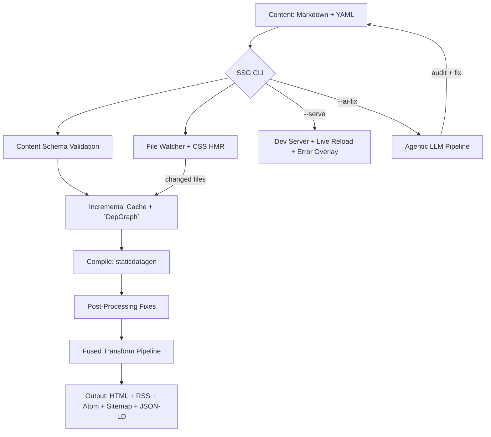

<!-- SPDX-License-Identifier: Apache-2.0 OR MIT -->

# Architecture

How SSG turns a directory of Markdown into a validated static site, and
where to look when you need to change something. For setting up a
toolchain and running the gates, see [`DEVELOPMENT.md`](../DEVELOPMENT.md).

## Contents

- [The build pipeline](#the-build-pipeline)
- [Workspace layout](#workspace-layout)
- [Inside the main crate](#inside-the-main-crate)
- [The plugin model](#the-plugin-model)
- [Concurrency](#concurrency)
- [Invariants](#invariants)
- [Recorded decisions](#recorded-decisions)

## The build pipeline

The property that distinguishes SSG from generators that render and stop
is that validation is *inside* the pipeline rather than after it. A page
failing an accessibility, security or metadata check is reported with its
file and line during the build, not discovered post-deploy. That is why
`ssg check` exists as a first-class subcommand: it is the same pipeline
with output suppressed.

## Workspace layout

The root crate is the CLI and the orchestration. Everything reusable —
or anything that must run somewhere the CLI cannot, such as a browser —
lives in its own workspace member:

| Crate | Responsibility |
|---|---|
| `ssg` (root) | CLI, build orchestration, plugin pipeline, dev server |
| `crates/ssg-core` | Platform-independent compilation pipeline; no filesystem assumptions, so it also builds for `wasm32` |
| `crates/ssg-a11y` | Standalone WCAG 2.2 AA checker, usable without the rest of SSG |
| `crates/ssg-search` | Browser-native vector semantic search |
| `crates/ssg-wasm` | WebAssembly bindings, size-gated by `make wasm-size` |
| `crates/ssg-rpc` | Edge RPC layer |
| `crates/ssg-rpc-macro` | Proc-macro implementing `#[ssg_rpc]` |
| `crates/ssg-mcp` | Model Context Protocol server over the RPC registry |

`ssg-mcp` is worth understanding as a pattern: it does not declare its
tools. It walks the `#[ssg_rpc]` registry at runtime, so a tool added to
SSG appears over MCP with no second declaration to keep in sync. Prefer
that shape when adding surfaces — a second inventory is a second thing
to drift.

## Inside the main crate

| Module | Contains |
|---|---|
| `src/cmd/` | clap definition, config discovery and validation, man page and completion generation |
| `src/core/` | The pipeline itself: content walking, frontmatter, dependency graph, incremental cache, streaming compilation, deployment |
| `src/plugins/` | Every transform, registered into an ordered pipeline |
| `src/audit/` | The audit gates run by `ssg audit` |
| `src/server/` | Dev server, file watcher, HMR fan-out |
| `src/util/` | HTML rewriting and shared helpers |

Two files in `src/cmd/` are generators rather than commands:
`man.rs` and `completions.rs` emit the packaging artefacts by walking
clap's own `Command`. Nothing there is transcribed by hand, and
`tests/man_page.rs` and `tests/completions.rs` fail if the parser gains
a flag those outputs do not carry.

## The plugin model

A plugin implements `Plugin` in `src/plugins/plugin.rs` and is registered
by `register_default_plugins`. The registration order *is* the execution
order — content validation and drafts filtering run before templating,
which runs before the HTML transforms, which run before output emission.

Two methods decide how the runner schedules a plugin:

- `has_transform()` — whether it rewrites HTML, so the runner can fuse
  every transforming plugin into a single pass over each document rather
  than reparsing per plugin.
- `needs_all_files()` — whether it needs the whole site at once (a
  sitemap does; a minifier does not), which decides whether it can run
  during streaming compilation.

`ssg plugins list --json` prints the live inventory with these flags.
Prefer reading that over any count written in prose: this document
deliberately states no plugin total, because nothing would gate it here.
The counts that *are* written down live in `README.md`, where
`tests/readme_sync.rs` checks them against the registered pipeline.

## Concurrency

There is no async runtime. Parallelism is Rayon over the file set, and
network calls are synchronous `ureq`. That is a deliberate choice, not an
omission — see [ADR-0001](adr/0001-tokio-free.md) and
[ADR-0002](adr/0002-rayon-orchestration.md). The dev server's HMR
fan-out uses synchronous `tungstenite` for the same reason
([ADR-0004](adr/0004-sync-tungstenite-for-hmr.md)).

The practical consequence for contributors: do not reach for `tokio` to
solve a concurrency problem here. A thread and a channel is the idiom,
and adding an async runtime would pull a large dependency tree through
the `cargo vet` gate described in `DEVELOPMENT.md`.

## Invariants

These hold crate-wide and are enforced, not merely intended:

- **`#![forbid(unsafe_code)]`** at the crate root.
- **Deterministic output.** The same input produces byte-identical
  output; CI compares build hashes across operating systems. Anything
  iterating a directory must sort, because `read_dir` order is not
  stable across filesystems.
- **Paths that become URLs use `/` on every platform.** `Site::rel`
  normalises the separator; a native separator leaking into a URL made
  the hreflang gate both false-positive and false-negative on Windows.
- **Emitted output must survive being parsed back.** Every minifier and
  rewriter bug found so far had the same shape: output that still looked
  like output but no longer parsed. `tests/transform_properties.rs`
  asserts idempotence and totality for the pure transforms.

## Recorded decisions

Choices that will be questioned later are written down as ADRs in
[`adr/`](adr/), in Nygard format. `tools/lint-adr.sh` enforces the
citation graph: an `adr: ADR-NNNN` comment anywhere in the tree must
resolve to a real file, so a decision cannot be cited after its record
is deleted.

Start with [ADR-0001](adr/0001-tokio-free.md) for the shape of the whole
system, and [ADR-0009](adr/0009-versioning-policy-0.0.x-until-0.0.999.md)
for why the version number looks the way it does.
